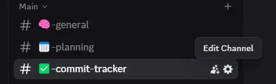

# 🍼 Commit Formatter Bot

<p align="center">
  
</p>

<p align="center">
  A tiny helper bot that lives in your Discord server and makes commit messages adorable 🧸 <br>
  It listens to whatever you type and replies with a cute little formatted update 💬✨
</p>

---

## 💡 What It Does

When someone types:

```
readme
```

The bot replies with:

```
✅ [Bryen] dropped a lil mimmit: `Readme`
```

---

## 🛠 Usage

1. [Add the bot](https://discord.com/oauth2/authorize?client_id=1372387773062844436&scope=bot&permissions=345152) to your server.
2. Go to the **channel settings**.
3. Under **Permissions**, add the bot under **Roles/Members**.
4. Toggle **✅ Send Messages** and **✅ Manage Messages** for that channel.

> Now the bot will only work in the channels you approve!

---

## 📸 Demo

<p align="center">
  
</p>

---

## 🌐 Hosted on Render

> `https://discord-bot-1-e79s.onrender.com`

---

<p align="center">
  Made with ❤️ by <strong>BryGuy</strong>
</p>